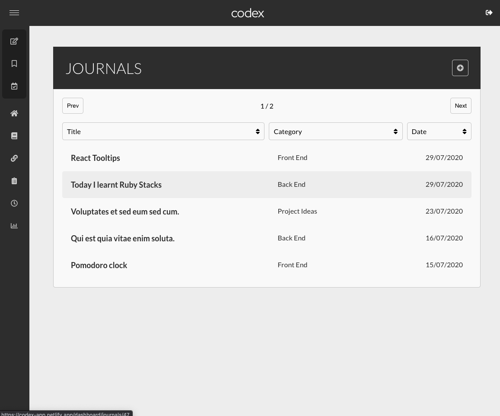
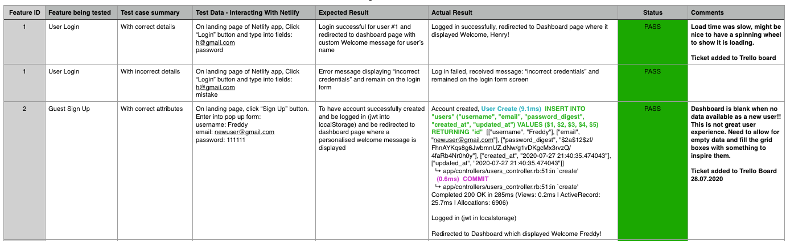

# Codex
```
Learning and productivity app for developers
````
*Built using React on Rails and styled with SASS*  
*Test driven development using RSPEC and Cypress* 

Created by Michael Shepherd and Emma Bindi

--- 

## <a name="toc"/>Table of Contents:</a>

[Links](#links)  
[Setup Instructions & Logins](#setup)   
[Purpose](#purpose)   
[Functionality & Features](#functionality)   
[Tech Stack](#techstack)   
[Target Audience](#targetaudience)  
[User Stories & Personas](#userstories)  
[Wireframes](#wireframes)  
[Screenshots](#screenshots)  
[Testing](#testing)  
[Project Management](#projectmgnt)  
[Planning Documentation & Diagrams](#planning)

---

<a name="links"/></a>
## Links  

#### Deployed Sites:
Netlify: https://codex-app.netlify.app/  
Heroku: https://codex-app-api.herokuapp.com/

#### Github:
API: https://github.com/emmabindi/Codex-API   
Client: https://github.com/mwshepherd/codex-client


---

<a name="setup"/></a>
## Setup Instructions (Local)

**API**
- Clone the api repo
- Bundle install to install all required dependencies
- Rake db:setup to create local database migrate and seed
- Rails s to run the rails server on Port 3000 

**Client**
- Clone the client repo
- Yarn install for all required dependencies
- Create .env.development file at root of folder, insert the below into this file:
``` js
PORT=8080
REACT_APP_BACKEND_URL=http://localhost:3000
```
(Or for production environment, create file .env and insert): 
``` js
REACT_APP_BACKEND_URL=https://codex-app-api.herokuapp.com/
```
- Yarn start to start server on Port 8080


### Logins

Email  | Password |   
| ------------ | :-------|    
| h@gmail.com | `password` 
| c@gmail.com | `password`   
| z@gmail.com | `password`   
| a@gmail.com | `password`   

[⇧](#toc)  

--- 

<a name="purpose"/></a>
## Purpose

- Capture the learning journey of developers, the wins, challenges, handy tools and progress 
- Create a centralised repository for reusable code snippets and useful bookmarks 
- Compile a summary of learnings which can be used for interviews and creating blog entries 
- Output useful statistics on learning and journalling progress to foster sense of achievement and motivation

&nbsp;

<a name="functionality"/></a>
## Functionality/Features   

1. **User Authentication**:   
Guests can sign up securely to create an account. Returning members can login to their account to view their private entries

2. **Journals**:  
Users can store private journal entries with option to include code snippets, tag with category and language. Sorting by title, creation date, category and language   

3. **Bookmarks**:   
Users can store url's with a description and tag by category and language 

4. **Timer**:   
A timer to count time spent coding and track total for user analytics and inspire reaching 10,000 hours

5. **Analytics**:   
User reporting to display totals and trends for of all entries, pie graphs displaying category and language break downs 

6. **Goals**:   
Tracking with due date and functionality to toggle when goal is achieved. Separate lists for active and completed goals


&nbsp;

<a name="techstack"/></a>

| Tech Stack  |   | 
|---|---|
| Languages  | JavaScript (ES6) <br/> HTML5 <br/>  CSS <br/> SASS <br/>  Ruby |  
| Frameworks | React <br/> Ruby on Rails  |  
| Database | PostgreSQL  | 
| Testing |  RSPEC <br/> Shouldamatchers <br/> SimpleCov <br/>  FactoryBot <br/>  Cypress <br/> Mochawesome |  
| Deployment | Heroku <br/>  Netlify |  
| Libraries | Draftjs <br/>  Chartjs <br/> Moment <br/> ChartKick  <br/> React-Tippy | 
| Gems | Knock <br/>  will_paginate <br/> Rubocop <br/>  Faker <br/> groupdate <br/> CORS | 
| Source Control | Git <br/> Github   |  
---


[⇧](#toc)  


<a name="targetaudience"/></a>
## Target Audience

The target audience for Codex is software developers in particular developers who are beginning their learning journey or going through a transition which requires tracking learning goals. 

As the technology industry changes so rapidly, developers need to continuously learn in order to keep their skills up to date. 

The target audience are tech savvy useers who own and use desktop/laptop computers daily. It is expected that the users of Codex will access using Desktop browser window 60% of the time and 40% of the time via their mobile devices. 

--- 
<a name="userstories"/></a>
## User Stories & Personas 

#### Persona #1: Liam 

Liam is a junior frontend developer who has been working for a tech company for nearly two years. He wants to level up his skills, either get a promotion or new role, and learn machine learning. To do this he requires a new skill set, such as learning CS concepts and learning Python.

In order for Liam to keep track of his notes and progress on his self studying journey, he requires a system to organise his notes and keep track of his studying progress. Since he is currently busy with his junior dev role, Liam aims to fit in a few hours of self study each day after work and on weekends.

Codex will be able to provide Liam the right tools for managing notes, journal entries, tracking study time and goals achieved as well as providing analytics. The app also allows him to bookmark useful links to relevant articles related to relevant topics. When commuting to work (not in lockdown), the app is accessible on mobile, allowing use on public transport.

**Liam's User Stories:** 

- As a user, I want to add daily journal entries, that log specific topics of things I learnt and keeping track of accomplishments and areas that need improvement
- As a user, I’d like to set goals, be able to check them off and see my progress on what has been achieved.
- As a user, I wish to organise my journal entries and bookmarks by categories, using folders and tags 
- As a user, I’d like to search for these entries and bookmarks that can be filtered through a search bar
- As a user, I want to keep track of my study time using a pomodoro timer, which will keep logs of the amount of total time studied per day
- As a user, I want to view detailed analytic reports of all app usage including how many journal entries, numbers of bookmarks saved, total time studied using the pomodoro clock and how often I achieve my set goals.
- As a user when creating journal entries, I want to be able to provide a title of the post and edit the body using a rich text editor that allows for code snippets, titles, and block quotes
- As a user a I wish to add or remove categories from my entries and bookmarks to reorganise entries when needed
- As a user, I require everything to be displayed in an accessible, intuitive and responsive dashboard.
- As a user, I want the ability to delete my account if necessary.


---

#### Persona #2: Blake

Blake is currently undertaking a full stack web development bootcamp and prior to this had no experience with coding. 

As a newbie to coding, Blake is having a hard time keeping track of all the new concepts and useful tools that she is learning at the bootcamp. Currently she has 13 bookmarks folders in her Chrome browser which she can’t search through easily, as well as notes in Google Docs, handy code snippets spread out everywhere- in the lesson materials, some within project source code and others just copy & pasted into the Notes app of her MacBook. 

Blake is wanting to centralise all her learning materials in one place and be able to search through them easily.  
Also, when Blake is preparing for job interviews she is finding it difficult to recall all of the new concepts she has learned and succinctly capture the wins and challenges from her coding journey so far. Blake would love clear data to show her learning progress and a summary of achievements to date.

Blake also has a few notepads on the desk where she is tracking the daily tasks to achieve and would love a one stop shop to capture a daily coding journal, any useful bookmarks or re-usable code snippets as well as have a task list all on the one screen. 

**Blake’s User Stories**

- As a user I want to track my daily code experiences which are captured with a date stamp, to gain an overview of my learning journey   
- As a user I want to tag my journal entries with themes such as #react #context   
- As a user I want to be able to record code blocks for future reference with syntax highlighting   
- As a user I want to store useful bookmarks into categories to organise my links   
- As a user I want to be able to search my journal entries by keywords   
- As a user I want to be able to filter my journal entries by date added
- As a user I want to be able to sort my bookmarks by category or tags  
- As a user I want to have a centralised dashboard for storing my bookmarks, journal entries and track my to-do tasks rather than 3 separate apps   
- As a user I want to track how much time I spend coding each day to achieve my #100daysofcode goals  
- As a user I want to produce reports showing data of how much time I have spent coding, how many journal entries I have recorded so I can be encouraged by the progress of my learning and see tangible evidence of my goal achievements    
- As a user I want to be able to access the app on mobile as well as desktop, as I am often reading Medium articles and Twitter on my train commute   
- As a user I want to be able to delete my account along with my personal data if I so wish  

--- 

#### Persona #3: Guest  

Guest: new visitor to Codex who is interested in finding out the functionality and features on offer. 

- As a guest, I want to be able to view the functionality and features of the site before signing up 

- As a guest I want to be able to sign up securely in order to be able to record my journal entries and data 

&nbsp;

--- 

#### User Stories Summary

Some user stories were removed from the final product as we determined a focus on MVP and the user stories outside of this MVP were omitted. This was to ensure we remained focus on achieving the MVP goals within the given timeframes.

For example, user stories removed: 
- As a user I want to see my Github activity and track that against my goals
- As a user I want to view my CodeWars kata status and list of completed challenges 
- As a user I want to receive notifications from Codex to alert me that it is my scheduled time to begin coding 
- As a user I want to be able to reset my password or change my email address 

Additional user stories were identified throughout the planning process and subsequently added, such as 'as a user I want to filter my journal entries by date'.  

[⇧](#toc)  

--- 

<a name="wireframes"/></a>
## Wireframes

Wireframes were created using Figma and have linked the click actions with navigations to subsequent pages as displayed below. 


#### Desktop Wireframes:


&nbsp;

#### Mobile Wireframes 


&nbsp;

[⇧](#toc)  

--- 

<a name="screenshots"/></a>
## Screenshots





iPad Device: 


Mobile Device:   


&nbsp;

[⇧](#toc)  

--- 

<a name="testing"/></a>
## Testing 

### **Manual Testing**

##### Features List for Testing:


#### **Development Environment**  


Re-Testing Previous Failures: 


#### **Production Environment**  


Re-Testing Previous Failures: 


&nbsp;

### **Automated Testing API (RSPEC)** 

Code Coverage Report:  


&nbsp;

### Automated Testing Client (Cypress)

Cypress Testing Report: 


&nbsp;

### Postman API Endpoint Collection 


### Manual Testing Summary 

The exercise of manual testing throughout development and production environments was very useful for our app development. 

The process of testing resulted in identification of bugs as well as any 'less than ideal' user experiences and as a result we added new tickets to our Trello To-Do lists to resolve these. 

*Example of testing comments providing useful feedback which resulted in additional Trello tickets*: 



[⇧](#toc)  

--- 

<a name="projectmgnt"/></a>
## Project Management

Methodology: 

We kicked off the project idea brainstorming together and worked the first few days of the development lifecycle together, sharing ideas and making decisions as a team. 

Once we had settled on a direction, determined MVP and had a rough outline of the timeframe in which we wanted to achieve we then discussed the strengths of each person and determined that although completing the project together as a team, we would put Michael in the drivers seat for the front end development aspect and Emma in the drivers seat for the back end development. 

Every single day of the development sprint we worked online together in a Discord server, constantly asking each other questions, sharing progress and helping each other out. Every day, the task goals for that day were assessed first thing in the morning with those tasks allocated to Emma or Michael and moved to Doing in the Trello board. The Trello board was revisited every day at lunch again to check in with progress. 

Despite each taking a drivers seat for API/client, both team members contributed to the code base of the other repository respectively. And all challenging or watershed aspects of the app development were tackled by pair programming. 

Below is an overview of the tasks completed each day which has been summarised from our shared daily journal and legend displays the delegation of tasks. 

**Project Development Journal & Delegation**  

### 

▪ Tasks completed together (pair programming)  
⚙︎ Tasks driven by Emma  
⌔ Tasks driven by Michael   

|  | Codex Sprint 1.0  | 
|---|---|
| Mon 13/07  | ▪ Idea & Name Decision <br/> ▪ Elevator Pitch <br/> ▪ Research tools/libraries <br/> ▪ Decide MVP features & sprinkles list <br/> ▪ Create personas & user stories <br/>  ⚙︎ Trello board setup <br/> ⚙︎ Architecture Diagram |
| Tues 14/07 | ⌔ Dataflow diagram <br/> ⌔ Develop wireframes web & mobile | 
| Wed 15/07 | ▪ Finalise wireframes & link interactions <br/>  ▪ ERD  |  
| Thur 16/07 | ⚙︎ TDD of API <br/> ⌔ Setup React App |  
| Fri 17/07 | ⚙︎ Heroku deployment <br/> ⚙︎ Test user authentication and API routes & requests <br/>  ▪ Submit planning documentation |  
| Mon 20/07  | ▪ Present planning deliverables <br/> ⌔ Custom CSS created for nav bar <br/> ⚙︎ Seed file content <br/> ⚙︎ Setup options for category & language lists <br/> ⌔ Front end journals component | 
| Tues 21/07 | ▪ Front end bookmarks component <br/>  ⌔ App refactor for Dynamic Components <br/>  |   
| Wed 22/07 | ⚙︎ Front end goals component <br/>  ⌔ Draftjs for new journal entries |  
| Thur 23/07 | ⌔ Pagination <br/>  ⌔ Sorting <br/>  ⚙︎ Setup analytics data in back end | 
| Fri 24/07 | ⌔ Analytics in front end with Chartjs & Chartkick <br/>  ▪ Edit journal functionality <br/>  ⌔ Netlify deployment |   
| Weekend  | ⚙︎ Rubocop offences <br/>  ⚙︎ Github workflow actions setup  <br/>  ⚙︎ Code coverage report & further RSPEC tests developed  <br/> ⌔ Styling  <br/>  ⚙︎ Cypress testing user login, adding new entries |  
| Mon 27/07  | ⚙︎ Error handling for user and entry creation <br/> ⚙︎ Manual testing <br/>  ⌔ Styling goals, dashboard <br/> ⌔ Setup random quote API to dashboard <br/> ⚙︎ Add sign up functionality  |  
| Tues 28/07 | ⌔ Styling dashboard, analytics <br/>  ⌔ Adding loading spinners to all pages <br/> ⚙︎ Add error handling for new goals/bookmarks  <br/> ⚙︎ Mochawesome and cypress testing <br/>  ⌔ Error handling for new journals |  
| Wed 29/07 | ▪ Timer functionality  <br/> ⚙︎ Finalise documentation  <br/> ⌔ Dashboard & landing content <br/>  ⌔ Styling with Tooltips <br/> ▪ Bug fixes | 
| Thur 30/07 | ▪ Final Touches & Landing Page Content <br/> ▪ PowerPoint Presentation  <br/> ▪ Final Deployment  <br/> ▪ Project Submission |  

--- 
*Daily Journal Link:*  
https://docs.google.com/document/d/1AOmoGZZMOlhJ6yNoMsIT5sWAxRDjho84fVcvT5xlfpo/edit?usp=sharing


&nbsp;


[⇧](#toc)  

&nbsp;

**Screenshots of Trello Progress:**  

Day 1 

Day 1: MVP vs Sprinkles

Day 2: Design tasks completed

Day 3: Progress is being made with design and planning tasks 

Day 4: 

Day 5: Close up Wireframes Task Management

Day 6: Back End TDD, Github Repos Created, React setup

Day 7: Progress

Day 7: React Components Task List
  
Day 9: Dynamic Components, React Routes 
  
Day 10: Data Analytics and Styling 

Day 11: Error Handling for New Users & Entries, Testing, Styling

Day 12: Loading Spinners, Dashboard Content, Manual Re Testing

Day 13: Timer, Final Styling Tweaks & Bugs, Netlify Deployment

Day 14: Final Documentation, Styling, PowerPoint, Submission


[⇧](#toc)  

---

<a name="planning"/></a>
## Planning Documentation & Diagrams

### Dataflow Diagram


&nbsp;
--- 

### Application Architecture Diagram	


--- 

### Entity Relationship Diagram v3


[⇧](#toc) 

--- 
END